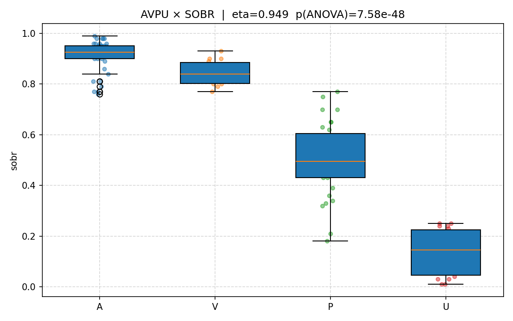
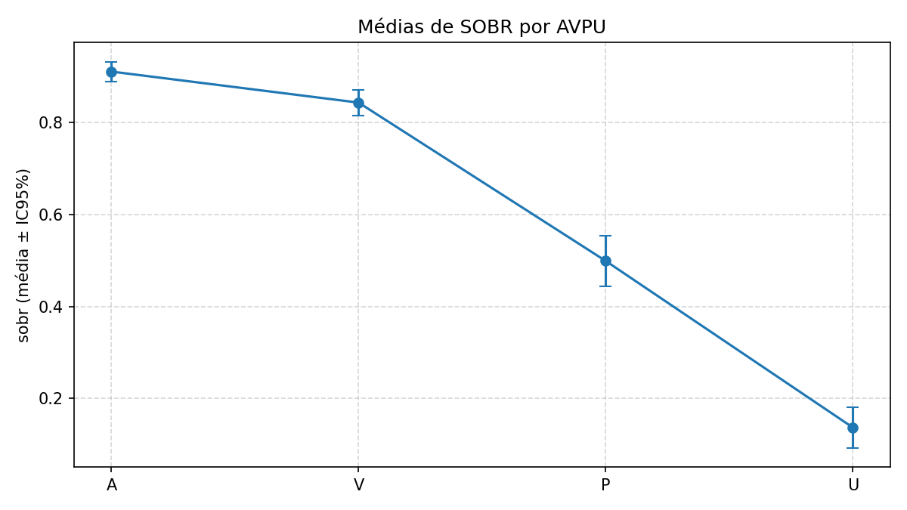

# AVPU × SOBR

- **Arquivo**: `data.csv`
- **Linhas válidas p/ análise**: 100

- **Eta (razão de correlação)**: 0.8910
- **ANOVA**: F=123.2839, p=8.329e-33

## Estatísticas por categoria
| avpu   |   N |   mean |   std |   ci95_lo |   ci95_hi |
|:-------|----:|-------:|------:|----------:|----------:|
| A      |  38 |  0.935 | 0.066 |     0.914 |     0.957 |
| V      |  15 |  0.83  | 0.068 |     0.793 |     0.867 |
| P      |  38 |  0.46  | 0.209 |     0.391 |     0.529 |
| U      |   9 |  0.139 | 0.074 |     0.082 |     0.195 |

## Gráficos

