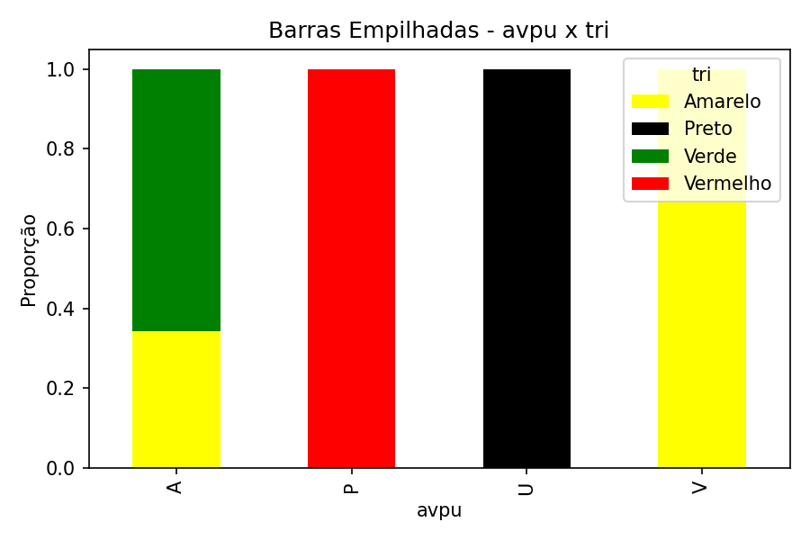
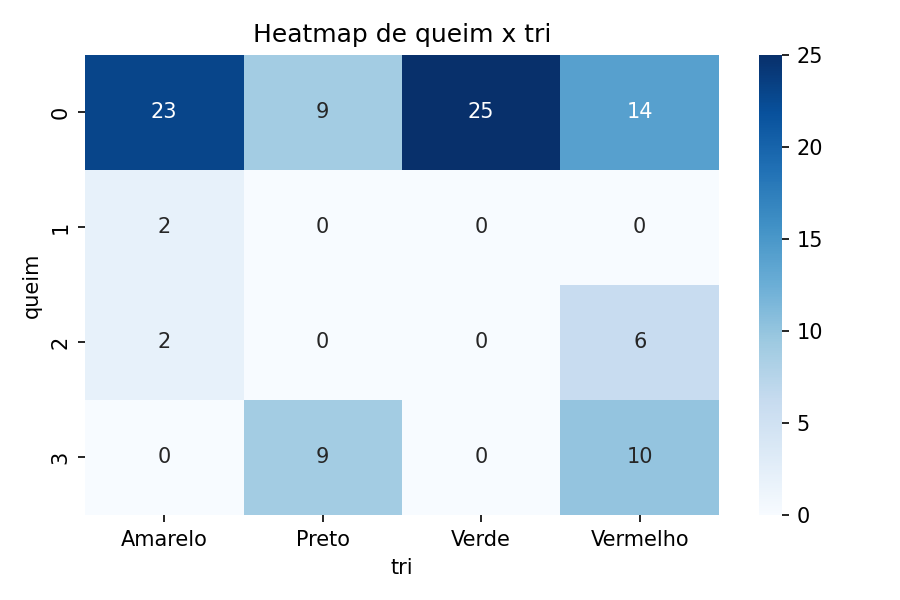
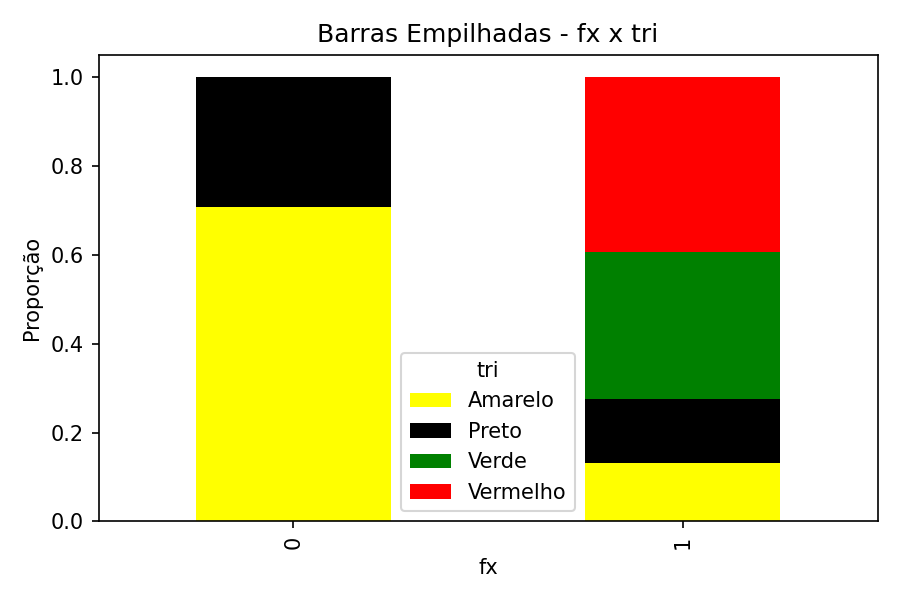

# Relatório Completo de Análises

Este relatório apresenta a análise de associação entre variáveis categóricas utilizando o **teste qui-quadrado**.

- **p-valor**: probabilidade de observar os dados ou algo mais extremo se não houver associação real. Valores pequenos (ex.: < 0,05) sugerem relação significativa.
- **Graus de liberdade (dof)**: representam quantas combinações independentes podem variar na tabela de contingência.

## Análise: avpu x tri

### Tabela de Contingência (Absoluta)

| avpu   |   Amarelo |   Preto |   Verde |   Vermelho |
|:-------|----------:|--------:|--------:|-----------:|
| A      |        13 |       0 |      25 |          0 |
| P      |         0 |       0 |       0 |         30 |
| U      |         0 |      18 |       0 |          0 |
| V      |        14 |       0 |       0 |          0 |

### Tabela de Proporções por Linha (%)

| avpu   |   Amarelo |   Preto |   Verde |   Vermelho |
|:-------|----------:|--------:|--------:|-----------:|
| A      |     34.21 |       0 |   65.79 |          0 |
| P      |      0    |       0 |    0    |        100 |
| U      |      0    |     100 |    0    |          0 |
| V      |    100    |       0 |    0    |          0 |

### Heatmap

### Barras Empilhadas

### Teste Qui-Quadrado

- Qui2 = 234.1131
- p-valor = 0.0000
- Graus de liberdade = 9

---

## Análise: queim x tri

### Tabela de Contingência (Absoluta)

|   queim |   Amarelo |   Preto |   Verde |   Vermelho |
|--------:|----------:|--------:|--------:|-----------:|
|       0 |        23 |       9 |      25 |         14 |
|       1 |         2 |       0 |       0 |          0 |
|       2 |         2 |       0 |       0 |          6 |
|       3 |         0 |       9 |       0 |         10 |

### Tabela de Proporções por Linha (%)

|   queim |   Amarelo |   Preto |   Verde |   Vermelho |
|--------:|----------:|--------:|--------:|-----------:|
|       0 |     32.39 |   12.68 |   35.21 |      19.72 |
|       1 |    100    |    0    |    0    |       0    |
|       2 |     25    |    0    |    0    |      75    |
|       3 |      0    |   47.37 |    0    |      52.63 |

### Heatmap

### Barras Empilhadas

### Teste Qui-Quadrado

- Qui2 = 43.8337
- p-valor = 0.0000
- Graus de liberdade = 9

---

## Análise: sg x tri

### Tabela de Contingência (Absoluta)

|   sg |   Amarelo |   Preto |   Verde |   Vermelho |
|-----:|----------:|--------:|--------:|-----------:|
|    0 |         0 |       0 |      25 |          0 |
|    1 |        11 |       0 |       0 |          0 |
|    2 |        16 |       0 |       0 |          0 |
|    3 |         0 |      18 |       0 |         30 |

### Tabela de Proporções por Linha (%)

|   sg |   Amarelo |   Preto |   Verde |   Vermelho |
|-----:|----------:|--------:|--------:|-----------:|
|    0 |         0 |     0   |     100 |        0   |
|    1 |       100 |     0   |       0 |        0   |
|    2 |       100 |     0   |       0 |        0   |
|    3 |         0 |    37.5 |       0 |       62.5 |

### Heatmap

### Barras Empilhadas

### Teste Qui-Quadrado

- Qui2 = 200.0000
- p-valor = 0.0000
- Graus de liberdade = 9

---

## Análise: fx x tri

### Tabela de Contingência (Absoluta)

|   fx |   Amarelo |   Preto |   Verde |   Vermelho |
|-----:|----------:|--------:|--------:|-----------:|
|    0 |        17 |       7 |       0 |          0 |
|    1 |        10 |      11 |      25 |         30 |

### Tabela de Proporções por Linha (%)

|   fx |   Amarelo |   Preto |   Verde |   Vermelho |
|-----:|----------:|--------:|--------:|-----------:|
|    0 |     70.83 |   29.17 |    0    |       0    |
|    1 |     13.16 |   14.47 |   32.89 |      39.47 |

### Heatmap

### Barras Empilhadas

### Teste Qui-Quadrado

- Qui2 = 42.0281
- p-valor = 0.0000
- Graus de liberdade = 3

---

## Análise: gcs x tri

### Tabela de Contingência (Absoluta)

|   gcs |   Amarelo |   Preto |   Verde |   Vermelho |
|------:|----------:|--------:|--------:|-----------:|
|     3 |         0 |       7 |       0 |          0 |
|     4 |         0 |       3 |       0 |          0 |
|     5 |         0 |       8 |       0 |          0 |
|     9 |         0 |       0 |       0 |         13 |
|    10 |         0 |       0 |       0 |         11 |
|    11 |         0 |       0 |       0 |          6 |
|    13 |        27 |       0 |       0 |          0 |
|    15 |         0 |       0 |      25 |          0 |

### Tabela de Proporções por Linha (%)

|   gcs |   Amarelo |   Preto |   Verde |   Vermelho |
|------:|----------:|--------:|--------:|-----------:|
|     3 |         0 |     100 |       0 |          0 |
|     4 |         0 |     100 |       0 |          0 |
|     5 |         0 |     100 |       0 |          0 |
|     9 |         0 |       0 |       0 |        100 |
|    10 |         0 |       0 |       0 |        100 |
|    11 |         0 |       0 |       0 |        100 |
|    13 |       100 |       0 |       0 |          0 |
|    15 |         0 |       0 |     100 |          0 |

### Heatmap

### Barras Empilhadas

### Teste Qui-Quadrado

- Qui2 = 300.0000
- p-valor = 0.0000
- Graus de liberdade = 21

---

