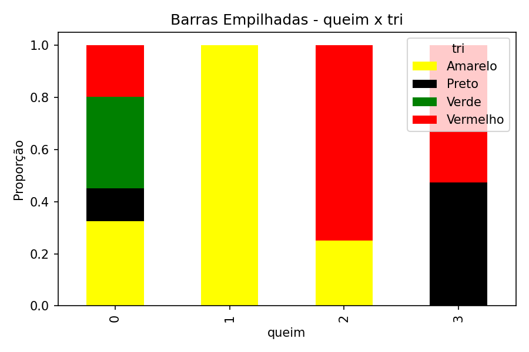
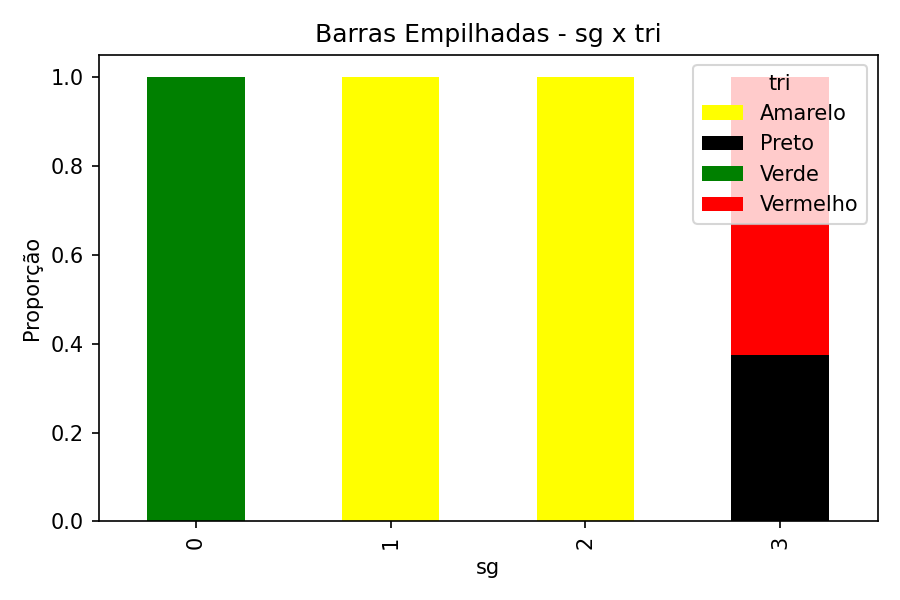
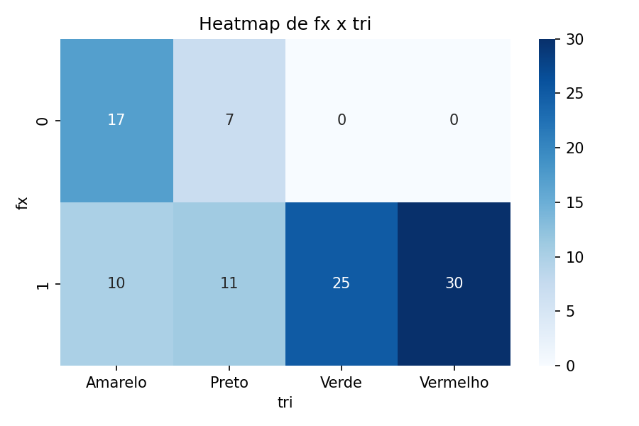

# Relatório Completo de Análises

Este relatório apresenta a análise de associação entre variáveis categóricas utilizando o **teste qui-quadrado**.

- **p-valor**: probabilidade de observar os dados ou algo mais extremo se não houver associação real. Valores pequenos (ex.: < 0,05) sugerem relação significativa.
- **Graus de liberdade (dof)**: representam quantas combinações independentes podem variar na tabela de contingência.

## Análise: avpu x tri

### Tabela de Contingência (Absoluta)

| avpu   |   Amarelo |   Preto |   Verde |   Vermelho |
|:-------|----------:|--------:|--------:|-----------:|
| A      |        10 |       0 |      28 |          0 |
| P      |         0 |       0 |       1 |         37 |
| U      |         0 |       9 |       0 |          0 |
| V      |        15 |       0 |       0 |          0 |

### Tabela de Proporções por Linha (%)

| avpu   |   Amarelo |   Preto |   Verde |   Vermelho |
|:-------|----------:|--------:|--------:|-----------:|
| A      |     26.32 |       0 |   73.68 |       0    |
| P      |      0    |       0 |    2.63 |      97.37 |
| U      |      0    |     100 |    0    |       0    |
| V      |    100    |       0 |    0    |       0    |

### Heatmap

### Barras Empilhadas

### Teste Qui-Quadrado

- Qui2 = 239.1289
- p-valor = 0.0000
- Graus de liberdade = 9

---

## Análise: queim x tri

### Tabela de Contingência (Absoluta)

|   queim |   Amarelo |   Preto |   Verde |   Vermelho |
|--------:|----------:|--------:|--------:|-----------:|
|       0 |        24 |       6 |      29 |         15 |
|       1 |         1 |       0 |       0 |          0 |
|       2 |         0 |       0 |       0 |         12 |
|       3 |         0 |       3 |       0 |         10 |

### Tabela de Proporções por Linha (%)

|   queim |   Amarelo |   Preto |   Verde |   Vermelho |
|--------:|----------:|--------:|--------:|-----------:|
|       0 |     32.43 |    8.11 |   39.19 |      20.27 |
|       1 |    100    |    0    |    0    |       0    |
|       2 |      0    |    0    |    0    |     100    |
|       3 |      0    |   23.08 |    0    |      76.92 |

### Heatmap

### Barras Empilhadas

### Teste Qui-Quadrado

- Qui2 = 48.8622
- p-valor = 0.0000
- Graus de liberdade = 9

---

## Análise: sg x tri

### Tabela de Contingência (Absoluta)

|   sg |   Amarelo |   Preto |   Verde |   Vermelho |
|-----:|----------:|--------:|--------:|-----------:|
|    0 |         0 |       0 |      28 |          0 |
|    1 |        11 |       0 |       0 |          0 |
|    2 |        14 |       0 |       0 |          0 |
|    3 |         0 |       9 |       1 |         37 |

### Tabela de Proporções por Linha (%)

|   sg |   Amarelo |   Preto |   Verde |   Vermelho |
|-----:|----------:|--------:|--------:|-----------:|
|    0 |         0 |    0    |  100    |       0    |
|    1 |       100 |    0    |    0    |       0    |
|    2 |       100 |    0    |    0    |       0    |
|    3 |         0 |   19.15 |    2.13 |      78.72 |

### Heatmap

### Barras Empilhadas

### Teste Qui-Quadrado

- Qui2 = 194.4974
- p-valor = 0.0000
- Graus de liberdade = 9

---

## Análise: fx x tri

### Tabela de Contingência (Absoluta)

|   fx |   Amarelo |   Preto |   Verde |   Vermelho |
|-----:|----------:|--------:|--------:|-----------:|
|    0 |        16 |       4 |       0 |          0 |
|    1 |         9 |       5 |      29 |         37 |

### Tabela de Proporções por Linha (%)

|   fx |   Amarelo |   Preto |   Verde |   Vermelho |
|-----:|----------:|--------:|--------:|-----------:|
|    0 |     80    |   20    |    0    |       0    |
|    1 |     11.25 |    6.25 |   36.25 |      46.25 |

### Heatmap

### Barras Empilhadas

### Teste Qui-Quadrado

- Qui2 = 50.1111
- p-valor = 0.0000
- Graus de liberdade = 3

---

## Análise: gcs x tri

### Tabela de Contingência (Absoluta)

|   gcs |   Amarelo |   Preto |   Verde |   Vermelho |
|------:|----------:|--------:|--------:|-----------:|
|     3 |         0 |       1 |       0 |          0 |
|     4 |         0 |       6 |       0 |          0 |
|     5 |         0 |       2 |       0 |          0 |
|     9 |         0 |       0 |       1 |         12 |
|    10 |         0 |       0 |       0 |         10 |
|    11 |         0 |       0 |       0 |         15 |
|    13 |        25 |       0 |       0 |          0 |
|    15 |         0 |       0 |      28 |          0 |

### Tabela de Proporções por Linha (%)

|   gcs |   Amarelo |   Preto |   Verde |   Vermelho |
|------:|----------:|--------:|--------:|-----------:|
|     3 |         0 |     100 |    0    |       0    |
|     4 |         0 |     100 |    0    |       0    |
|     5 |         0 |     100 |    0    |       0    |
|     9 |         0 |       0 |    7.69 |      92.31 |
|    10 |         0 |       0 |    0    |     100    |
|    11 |         0 |       0 |    0    |     100    |
|    13 |       100 |       0 |    0    |       0    |
|    15 |         0 |       0 |  100    |       0    |

### Heatmap

### Barras Empilhadas

### Teste Qui-Quadrado

- Qui2 = 294.3222
- p-valor = 0.0000
- Graus de liberdade = 21

---

