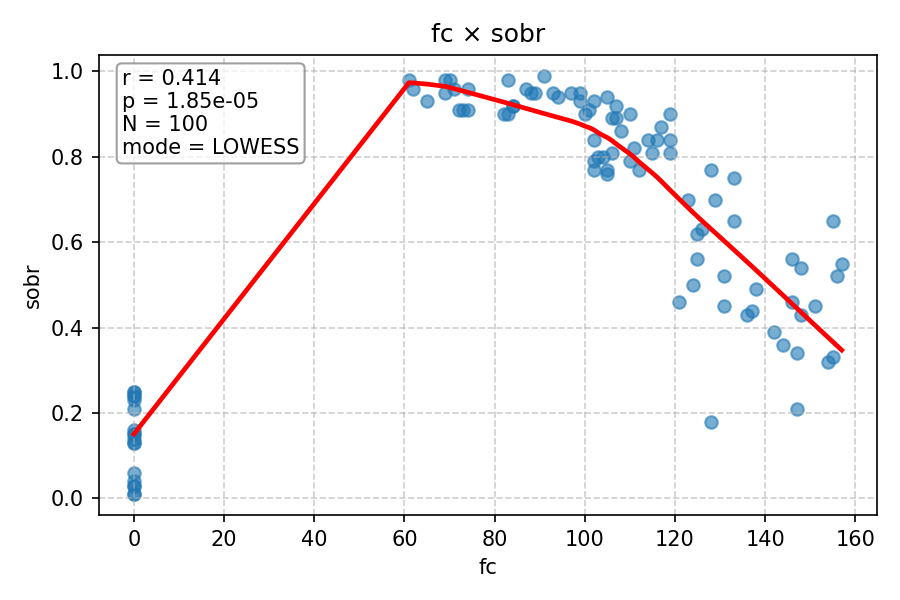
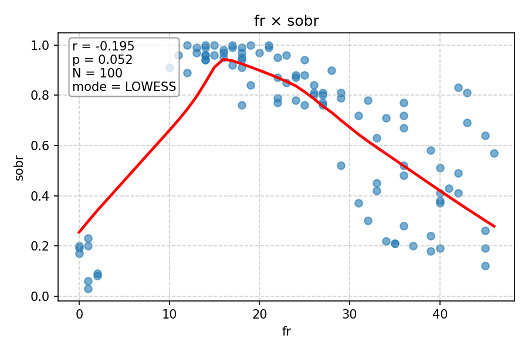
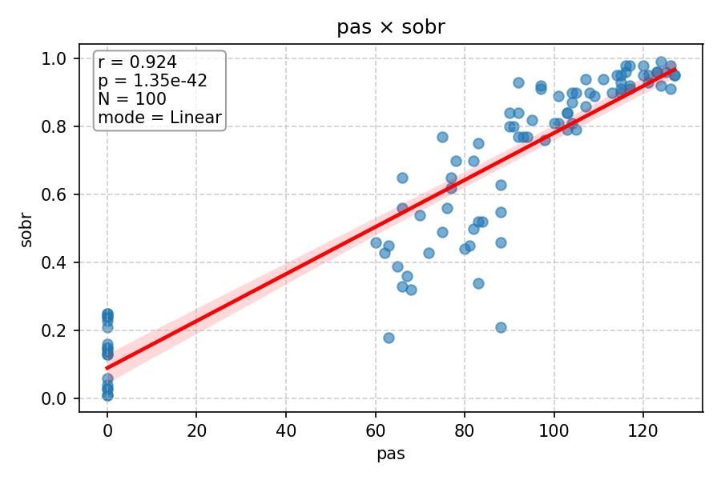
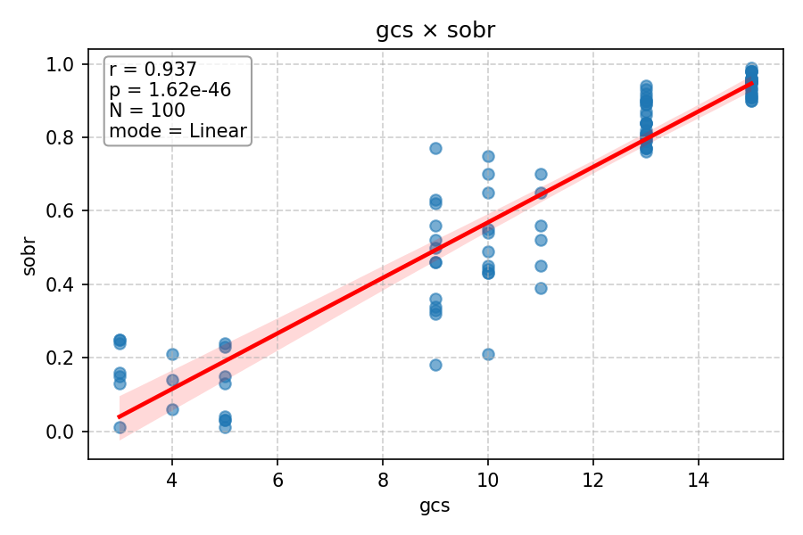

# Relatório de Correlações (Pearson) com LOWESS

Este relatório apresenta a análise de correlação entre variáveis numéricas usando o **coeficiente de Pearson**.
- O **coeficiente de Pearson (r)** mede a relação linear entre duas variáveis.
- O **LOWESS com comutação automática** desenha uma curva suave para mostrar tendências não-lineares quando a correlação é fraca ou p-valor alto.
- Se a correlação é forte e significativa, usa-se regressão linear para a linha de tendência.

---

## fc × sobr

- r = 0.414, p = 1.85e-05, N = 100, modo = LOWESS

---

## fr × sobr

- r = 0.211, p = 0.035, N = 100, modo = LOWESS

---

## pas × sobr

- r = 0.924, p = 1.35e-42, N = 100, modo = Linear

---

## spo2 × sobr

- r = 0.834, p = 4.41e-27, N = 100, modo = Linear

---

## gcs × sobr

- r = 0.937, p = 1.62e-46, N = 100, modo = Linear

---
