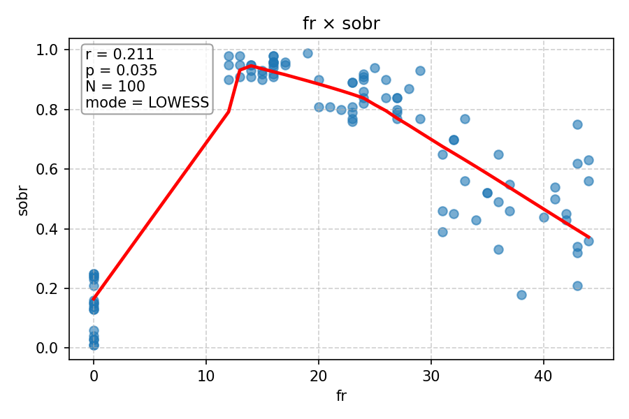
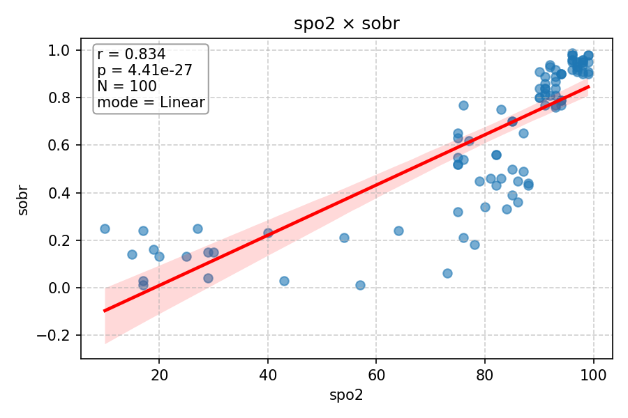

# Relatório de Correlações (Pearson) com LOWESS

Este relatório apresenta a análise de correlação entre variáveis numéricas usando o **coeficiente de Pearson**.
- O **coeficiente de Pearson (r)** mede a relação linear entre duas variáveis.
- O **LOWESS com comutação automática** desenha uma curva suave para mostrar tendências não-lineares quando a correlação é fraca ou p-valor alto.
- Se a correlação é forte e significativa, usa-se regressão linear para a linha de tendência.

---

## fc × sobr

- r = -0.017, p = 0.866, N = 100, modo = LOWESS

---

## fr × sobr

- r = -0.195, p = 0.052, N = 100, modo = LOWESS

---

## pas × sobr

- r = 0.838, p = 1.81e-27, N = 100, modo = Linear

---

## spo2 × sobr

- r = 0.713, p = 9.24e-17, N = 100, modo = LOWESS

---

## gcs × sobr

- r = 0.839, p = 1.26e-27, N = 100, modo = Linear

---
