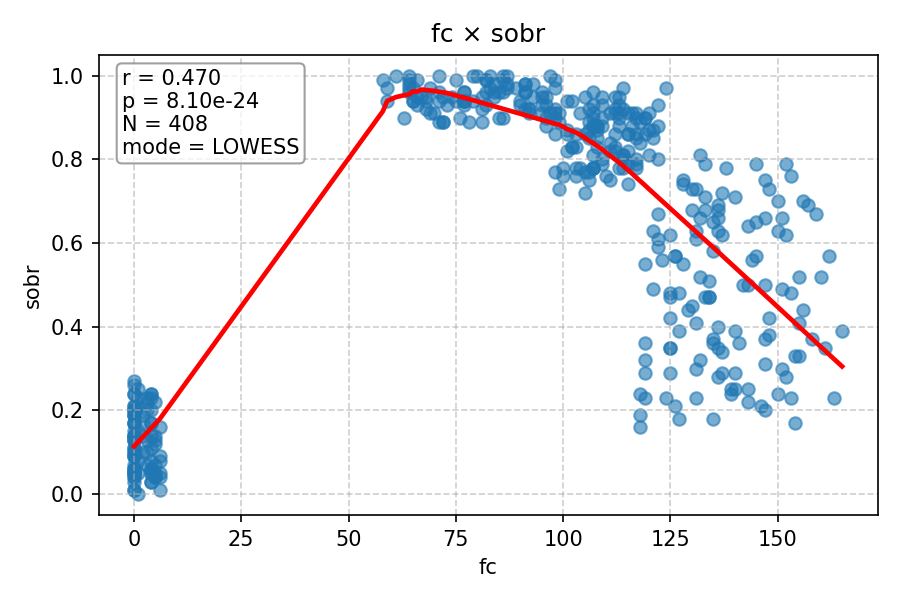
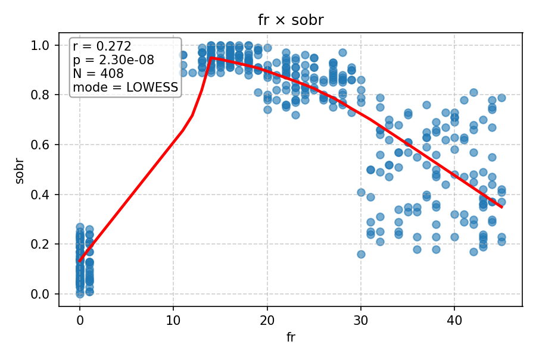
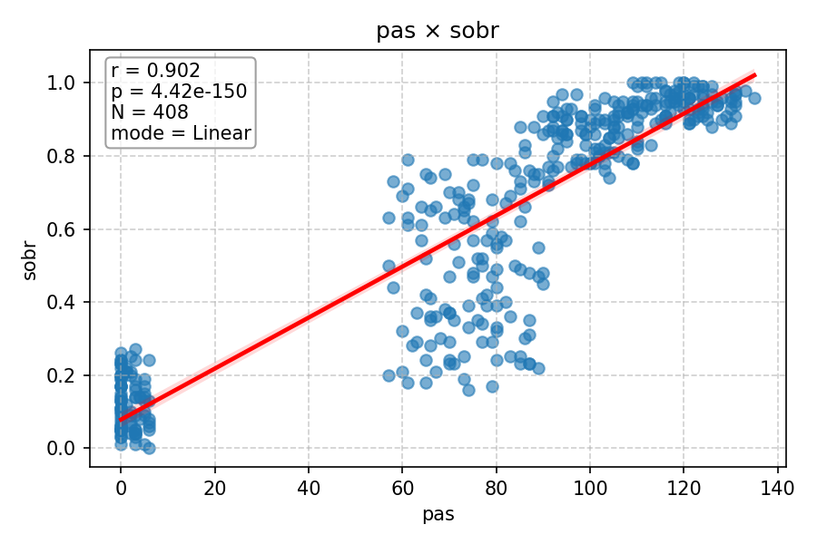
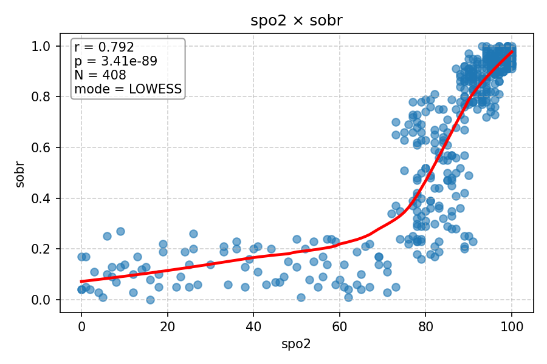
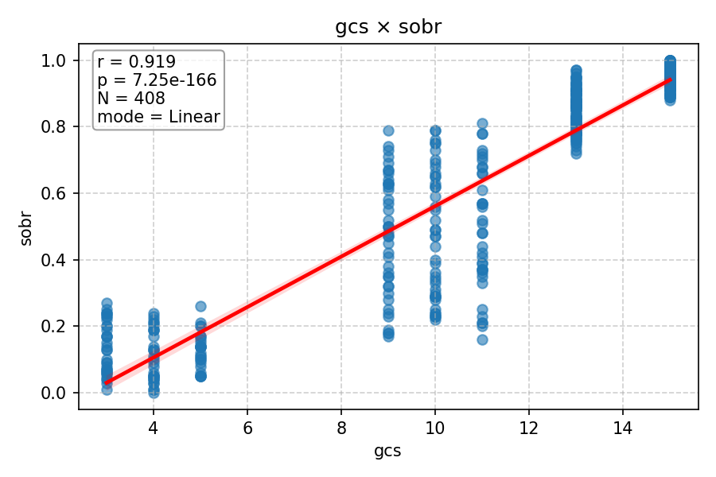

# Relatório de Correlações (Pearson) com LOWESS

Este relatório apresenta a análise de correlação entre variáveis numéricas usando o **coeficiente de Pearson**.
- O **coeficiente de Pearson (r)** mede a relação linear entre duas variáveis.
- O **LOWESS com comutação automática** desenha uma curva suave para mostrar tendências não-lineares quando a correlação é fraca ou p-valor alto.
- Se a correlação é forte e significativa, usa-se regressão linear para a linha de tendência.

---

## fc × sobr

- r = 0.470, p = 8.10e-24, N = 408, modo = LOWESS

---

## fr × sobr

- r = 0.272, p = 2.30e-08, N = 408, modo = LOWESS

---

## pas × sobr

- r = 0.902, p = 4.42e-150, N = 408, modo = Linear

---

## spo2 × sobr

- r = 0.792, p = 3.41e-89, N = 408, modo = LOWESS

---

## gcs × sobr

- r = 0.919, p = 7.25e-166, N = 408, modo = Linear

---
