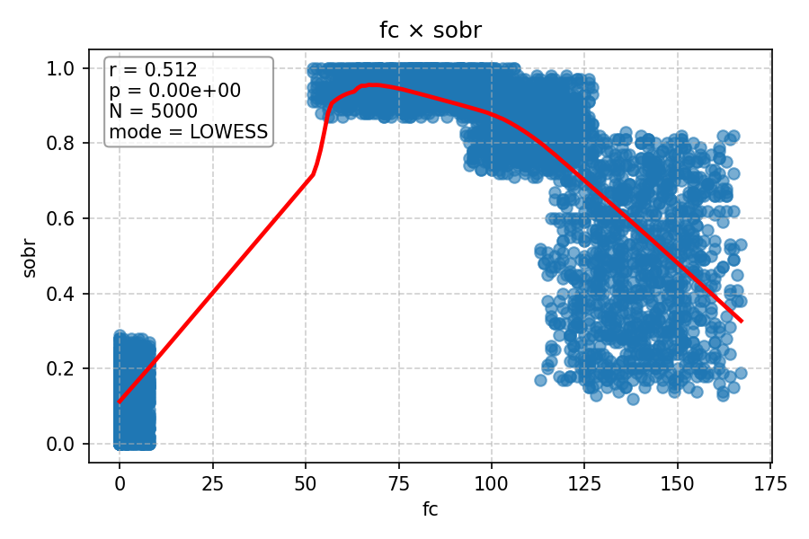
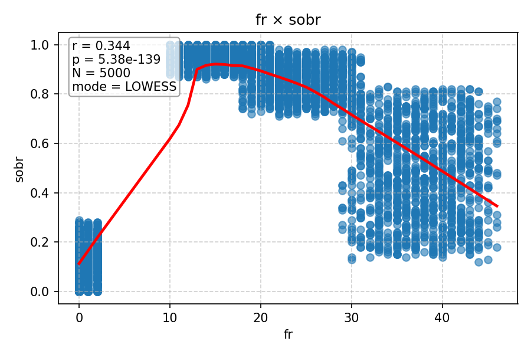
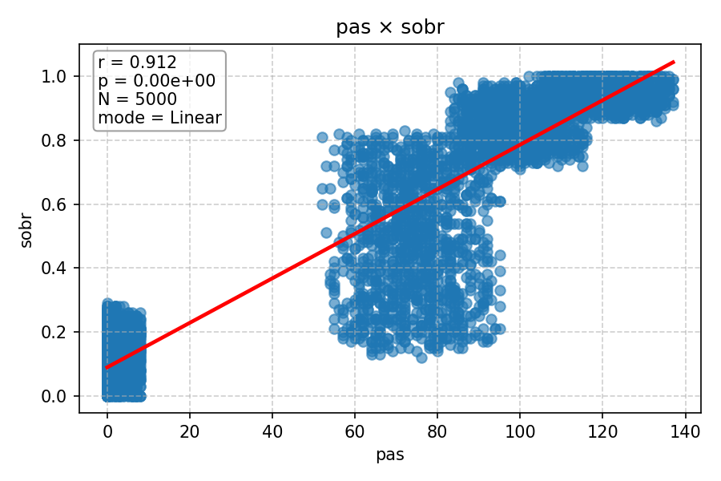
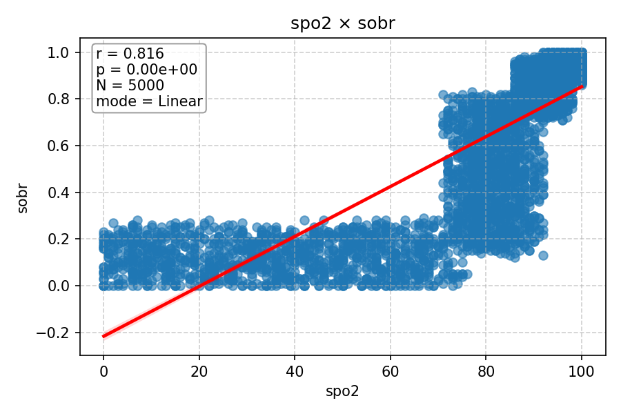
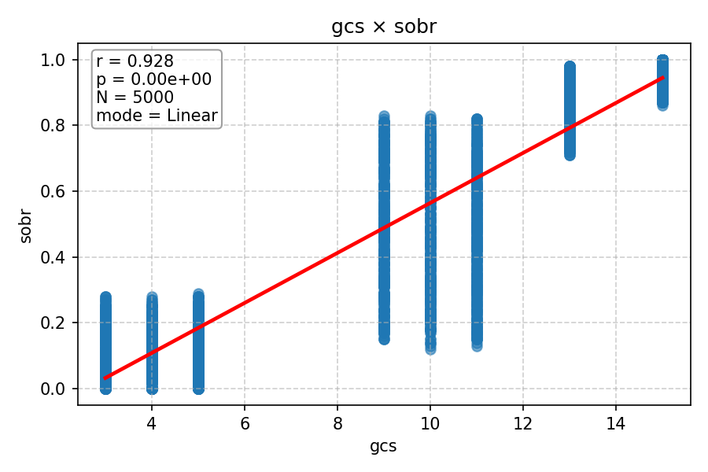

# Relatório de Correlações (Pearson) com LOWESS

Este relatório apresenta a análise de correlação entre variáveis numéricas usando o **coeficiente de Pearson**.
- O **coeficiente de Pearson (r)** mede a relação linear entre duas variáveis.
- O **LOWESS com comutação automática** desenha uma curva suave para mostrar tendências não-lineares quando a correlação é fraca ou p-valor alto.
- Se a correlação é forte e significativa, usa-se regressão linear para a linha de tendência.

---

## fc × sobr

- r = 0.512, p = 0.00e+00, N = 5000, modo = LOWESS

---

## fr × sobr

- r = 0.344, p = 5.38e-139, N = 5000, modo = LOWESS

---

## pas × sobr

- r = 0.912, p = 0.00e+00, N = 5000, modo = Linear

---

## spo2 × sobr

- r = 0.816, p = 0.00e+00, N = 5000, modo = Linear

---

## gcs × sobr

- r = 0.928, p = 0.00e+00, N = 5000, modo = Linear

---
